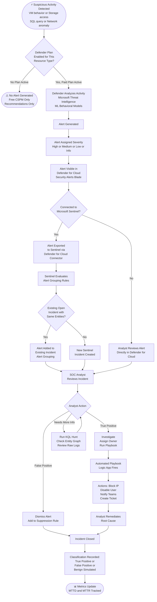
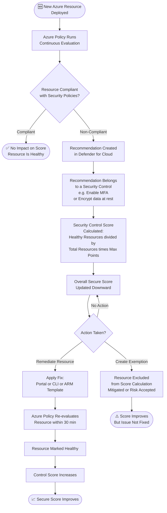

# Microsoft Defender for Cloud — Alert Lifecycle Diagrams

> 📌 AZ-500 Exam Objective: Plan, implement, and manage security posture management and workload protection using Microsoft Defender for Cloud
> 🏷️ Domain: 4 — Defender for Cloud and Sentinel | Weight: 30–35%

***

## Diagram 1: Defender for Cloud Alert Lifecycle

This shows the full path from a suspicious activity to a closed incident. Understanding this flow helps you answer scenario questions about alert triage and response.

### Step-by-Step Explanation

**Step 1 — Activity Detected:** Something suspicious happens. This could be a VM running a port scan, a storage account accessed from an unusual country, a SQL query that looks like an injection attempt, or a network connection to a known malicious IP.

**Step 2 — Plan Check:** Defender for Cloud's free tier only gives security recommendations and a secure score. It does NOT generate threat alerts. You must have the paid Defender plan enabled for that resource type (e.g., Defender for Servers for VM alerts, Defender for Storage for storage alerts).

**Step 3 — Alert Generated:** Defender uses Microsoft's threat intelligence database and machine learning to decide if the activity is suspicious. It then creates an alert with a title, description, affected resource, and severity level.

**Step 4 — Sentinel Integration:** If you connected Defender for Cloud to Microsoft Sentinel using the native data connector, alerts automatically flow into Sentinel. This is the recommended setup for enterprise SOC teams.

**Step 5 — Alert Grouping:** Sentinel's alert grouping rules check if this alert belongs to an existing open incident (based on shared entities like the same IP address or user). If yes, the alert is added to that incident instead of creating a new one. This reduces alert fatigue.

**Step 6 — Analyst Review:** The SOC analyst looks at the incident. They can view the entity graph (which users, IPs, and hosts are involved), run additional KQL queries, and bookmark interesting findings.

**Step 7 — Automated Response:** A playbook (Logic App) can fire automatically via an automation rule, or the analyst can trigger it manually. Common actions: send a Teams alert, block a malicious IP in the firewall, disable a compromised user account, or open a ticket in ServiceNow.

**Step 8 — Close with Classification:** Every incident must be closed with a classification. This data helps track your Mean Time to Detect (MTTD) and Mean Time to Respond (MTTR) metrics.

***

## Diagram 2: Secure Score Impact Flow

This shows how a single non-compliant resource affects your Secure Score and what to do about it.

### Step-by-Step Explanation

**Step 1 — New Resource:** Every time you deploy a resource (VM, storage account, SQL database), Azure Policy evaluates it against the assigned security initiative (usually the Azure Security Benchmark).

**Step 2 — Recommendation Created:** If the resource fails a policy check (e.g., a VM has no endpoint protection, or a storage account allows public access), Defender for Cloud creates a recommendation in the "Recommendations" blade.

**Step 3 — Security Control:** Recommendations are grouped into Security Controls. Each control has a maximum point value. For example, the "Enable MFA" control might be worth 10 points.

**Step 4 — Score Calculation:** The control's score = (number of healthy resources / total resources) × maximum points. If half your VMs are compliant with a 10-point control, you get 5 points.

**Step 5 — Remediate or Exempt:** You can fix the issue directly from the recommendation page (Defender for Cloud has a "Quick Fix" button for many recommendations). Or you can create an exemption to say "this resource is intentionally configured this way" — the resource is then removed from the score calculation.

**Exam Trap:** An exemption improves your score but does NOT fix the security issue.

***

## AZ-500 Exam Tips for These Diagrams

- **Trigger Words:** "Defender for Cloud", "security alert", "CWPP", "workload protection", "secure score", "recommendation", "security control", "exemption"
- **Key Trap:** Defender for Cloud free tier = CSPM only (posture, recommendations, no threat alerts). Paid plans = CWPP (threat detection alerts). You need BOTH for a complete security picture.
- **Key Trap:** Alerts in Defender for Cloud and incidents in Sentinel are different things. Defender generates alerts. Sentinel creates incidents by grouping alerts.
- **Key Trap:** Exemptions improve Secure Score but do NOT fix the underlying security issue.
- **Key Trap:** Alert suppression rules prevent future similar alerts from appearing — useful for known benign activities.
- **Memorization Tip:** Defender = DETECT threats. Sentinel = INVESTIGATE and RESPOND to threats.

---

📚 Further Reading: https://learn.microsoft.com/en-us/azure/defender-for-cloud/alerts-overview
🔄 Last Verified: 2026 (AZ-500 January 2026 objectives)
