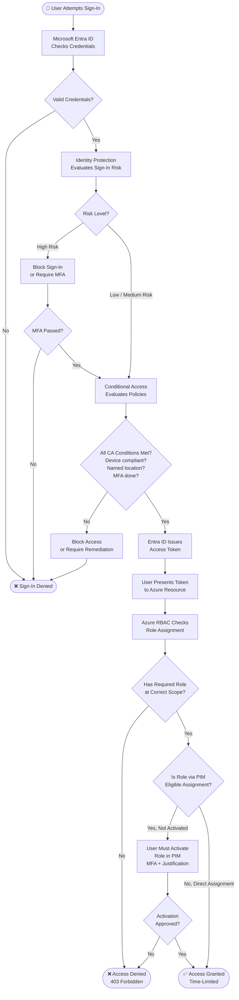
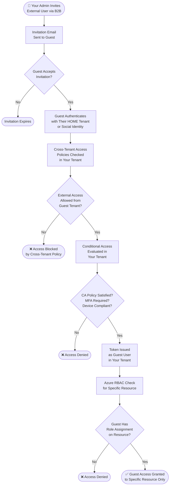

# Identity and Access Flow Diagrams

> 📌 AZ-500 Exam Objective: Manage Microsoft Entra identities; implement and manage Microsoft Entra authentication and authorization
> 🏷️ Domain: 1 — Secure Identity and Access | Weight: 15–20%

***

## Diagram 1: User Sign-In and Access Flow

This diagram shows what happens every time a user tries to sign in and access an Azure resource. Each step is a security checkpoint.

### Step-by-Step Explanation

**Step 1 — Credential Check:** Entra ID verifies the username and password (or Windows Hello, FIDO2 key, certificate).

**Step 2 — Identity Protection Risk Score:** Microsoft's AI evaluates the sign-in. It looks at the IP address, device, location, and sign-in history. It assigns a risk score: Low, Medium, or High.

**Step 3 — High Risk Branch:** If the risk is high (e.g., sign-in from a new country, leaked credential), the system blocks access or forces MFA. If MFA fails, access is denied.

**Step 4 — Conditional Access Evaluation:** Even after passing credentials, Conditional Access policies run. They check: Is the device compliant? Is the user in a named location? Has MFA been completed? Is the app allowed?

**Step 5 — Token Issued:** If all checks pass, Entra ID issues a JWT access token. This token proves the user's identity.

**Step 6 — Azure RBAC Check:** When the user tries to do something in Azure (open a storage account, start a VM), Azure RBAC checks if the user has the right role at the right scope (management group → subscription → resource group → resource).

**Step 7 — PIM Check:** If the role was assigned as "eligible" in PIM (not "active"), the user must first activate it. Activation may require MFA, a justification, and an approver's sign-off. The access is then granted for a fixed time window (e.g., 1–8 hours).

***

## Diagram 2: B2B Guest User Access Flow

This shows how an external partner (from a different company) gets access to your Azure resources without you managing their password.

### Step-by-Step Explanation

**Step 1 — Invitation:** Your admin sends a B2B invitation. The guest receives an email with a redemption link.

**Step 2 — Guest Authenticates at Home:** The guest signs in using their own company's credentials (or a Microsoft/Google account). You never manage their password.

**Step 3 — Cross-Tenant Access Policy:** Your tenant checks its cross-tenant access settings. You can block guests from specific tenants or require MFA regardless of what the guest's home tenant does.

**Step 4 — Conditional Access in Your Tenant:** Your CA policies apply to guest users too. You can require MFA for all guests, restrict access to certain apps, or block access from non-compliant devices.

**Step 5 — RBAC Scoped Access:** The guest only gets access to what you explicitly assigned. They do not inherit broad permissions. Assign the least-privileged role at the narrowest scope.

***

## AZ-500 Exam Tips for This Diagram

- **Trigger Words:** "just-in-time", "eligible activation", "Conditional Access", "sign-in risk", "cross-tenant access", "B2B guest"
- **Key Trap:** PIM controls WHEN a role is active. RBAC controls WHAT the role can do. They work together, not in place of each other.
- **Key Trap:** Conditional Access runs in YOUR tenant for B2B guests. The guest's home tenant CA policies do not protect your resources.
- **Memorization Tip:** Sign-in flow = Credentials → Risk → CA → Token → RBAC → (PIM if eligible)

---

📚 Further Reading: https://learn.microsoft.com/en-us/entra/identity/conditional-access/overview
🔄 Last Verified: 2026 (AZ-500 January 2026 objectives)
