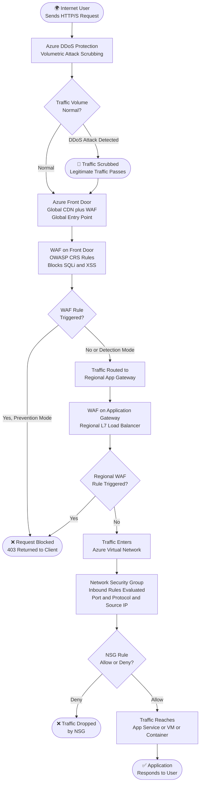
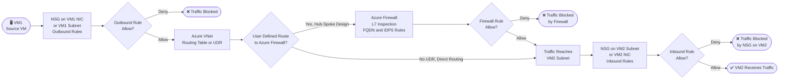
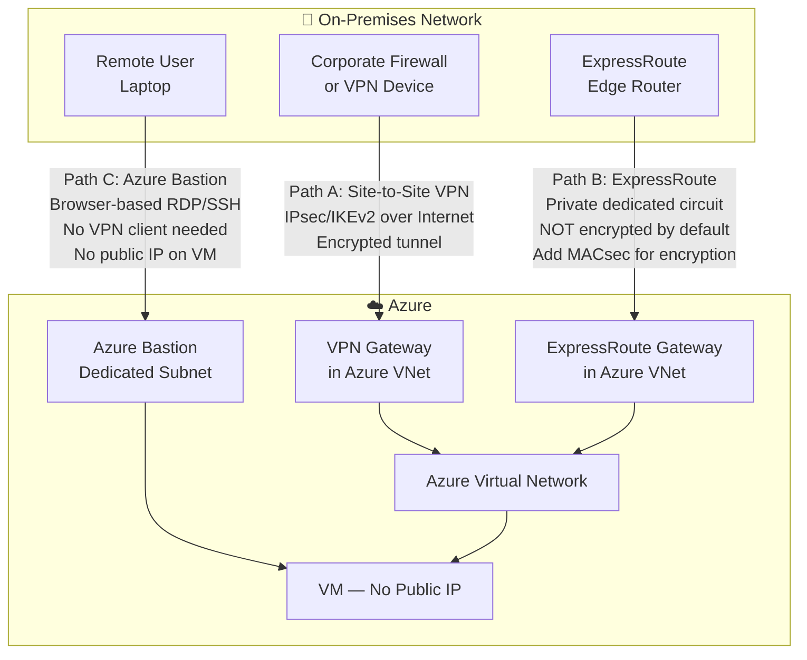

# Azure Network Traffic Path Diagrams

> 📌 AZ-500 Exam Objective: Plan and implement security for virtual networks; plan and implement advanced security for infrastructure
> 🏷️ Domain: 2 — Secure Networking | Weight: 20–25%

***

## Diagram 1: Inbound Internet Traffic to a Web Application

This shows every security layer that internet traffic passes through before reaching your application. Each layer can block the traffic.

### Step-by-Step Explanation

**Step 1 — DDoS Protection:** Before traffic even enters your network, Azure DDoS Protection watches for floods of traffic (volumetric attacks). It scrubs bad traffic and lets real users through.

**Step 2 — Azure Front Door + WAF:** Front Door is the global entry point. It routes users to the nearest Azure region. The WAF here blocks common web attacks (SQL injection, cross-site scripting) using OWASP CRS rules.

**Step 3 — Application Gateway + WAF:** Inside the region, Application Gateway acts as a layer-7 load balancer. It has its own WAF that can apply different rules per application.

**Step 4 — Network Security Group:** The last line of defense before the application. The NSG checks the packet's port, protocol, and source IP against its rules. The lowest priority number wins.

**Step 5 — Application:** Only traffic that passed every check reaches the application.

***

## Diagram 2: VM-to-VM Traffic (East-West / Internal)

This shows how traffic moves between virtual machines inside Azure — and how to control it.

### Step-by-Step Explanation

**Step 1 — Outbound NSG on VM1:** Traffic leaving VM1 is checked against outbound NSG rules. The NSG can be on the NIC or the subnet (subnet rules apply to all VMs in that subnet).

**Step 2 — Routing Table / UDR:** Azure routes traffic based on the routing table. In a hub-and-spoke design, a User Defined Route (UDR) forces all traffic through the Azure Firewall hub. Without a UDR, traffic goes directly to VM2.

**Step 3 — Azure Firewall (hub-spoke only):** If traffic hits the Firewall, it is inspected at Layer 7. The Firewall can block by FQDN, detect threats with IDPS, and log all connections.

**Step 4 — Inbound NSG on VM2:** Even after reaching VM2's subnet, the inbound NSG runs. You should always apply NSG rules on both sides (defense in depth).

***

## Diagram 3: On-Premises to Azure Connectivity Options

This shows three different ways to connect your on-premises network to Azure.

### Step-by-Step Explanation

**Path A — Site-to-Site VPN:** Your on-premises VPN device connects to Azure VPN Gateway over the public internet. The tunnel is encrypted using IPsec/IKEv2. This is the most common hybrid connectivity option. It is good for smaller workloads or when ExpressRoute is not available.

**Path B — ExpressRoute:** A dedicated private circuit from your data center to Azure. Traffic never touches the public internet. This gives higher bandwidth, lower latency, and a higher SLA. **Important exam trap:** ExpressRoute is NOT encrypted by default. You must add MACsec (at the physical layer) or run IPsec over it to encrypt data.

**Path C — Azure Bastion:** A single user connects to a VM in Azure using just a browser. No VPN client is needed. The VM does not need a public IP address. Bastion lives in its own dedicated subnet (AzureBastionSubnet). This is not a network-to-network connection — it is for individual user access to VMs.

***

## AZ-500 Exam Tips for These Diagrams

- **Trigger Words:** "inbound traffic", "WAF", "NSG", "east-west", "hub-spoke", "site-to-site", "ExpressRoute", "Bastion", "no public IP"
- **Key Trap:** NSG is checked twice for east-west traffic — once on the sending VM (outbound) and once on the receiving VM (inbound).
- **Key Trap:** ExpressRoute does NOT encrypt traffic. VPN Gateway encrypts using IPsec.
- **Key Trap:** Azure Bastion is for individual user VM access, not network-to-network connectivity.
- **Key Trap:** WAF on Front Door and WAF on App Gateway are separate — you can have both for defense in depth.
- **Memorization Tip:** Internet inbound flow = DDoS → Front Door WAF → App Gateway WAF → NSG → App

---

📚 Further Reading: https://learn.microsoft.com/en-us/azure/networking/fundamentals/networking-overview
🔄 Last Verified: 2026 (AZ-500 January 2026 objectives)
