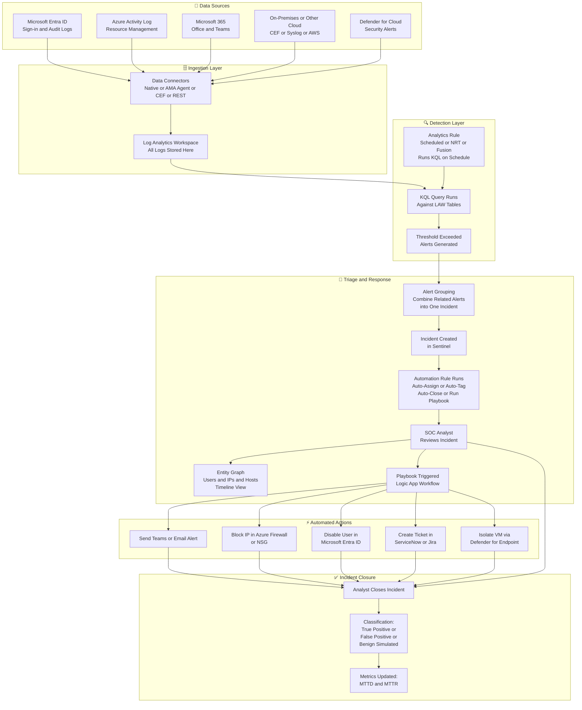
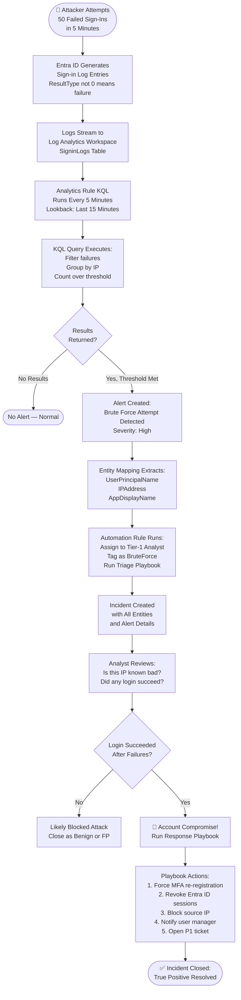
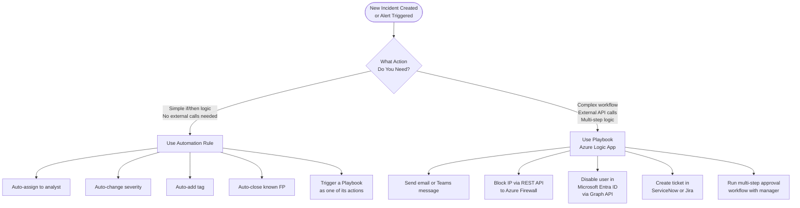

# Microsoft Sentinel — Incident Workflow Diagrams

> 📌 AZ-500 Exam Objective: Plan and implement Microsoft Sentinel; configure analytics rules and manage incidents; configure automation and playbooks
> 🏷️ Domain: 4 — Defender for Cloud and Sentinel | Weight: 30–35%

***

## Diagram 1: End-to-End Sentinel Incident Workflow

This diagram shows the full lifecycle of a security incident in Microsoft Sentinel — from raw log ingestion to a closed, classified incident.



### Step-by-Step Explanation

**Step 1 — Data Sources:** Sentinel is only as good as the data you feed it. Common sources include Microsoft Entra ID sign-in logs, Azure Activity logs (who did what to which resource), Microsoft 365 logs (email, Teams, SharePoint), on-premises servers via CEF/Syslog, and Defender for Cloud security alerts.

**Step 2 — Data Connectors:** Each source connects through a data connector. Microsoft native connectors (Entra ID, Defender, M365) connect with a few clicks. Non-Microsoft sources use the Azure Monitor Agent (AMA) or the older Microsoft Monitoring Agent (MMA). Custom sources use the REST API or Azure Function Apps.

**Step 3 — Log Analytics Workspace:** All logs land in a Log Analytics Workspace. This is Sentinel's data store. You query it with KQL. Storage costs money — plan your retention settings carefully.

**Step 4 — Analytics Rule:** An analytics rule runs a KQL query on a schedule (e.g., every 5 minutes, looking back at the last 1 hour). Near-Real-Time (NRT) rules run every 1 minute for the most time-sensitive detections.

**Step 5 — Alert Generated:** When the KQL query returns results above the threshold, an alert fires. The rule also extracts entities (user, IP, host) from the query results — these are used in the incident investigation.

**Step 6 — Alert Grouping:** If you enable alert grouping on the analytics rule, Sentinel looks for an existing open incident with the same entities. If found, it adds this alert to that incident instead of creating a new one. This prevents the same attack from generating dozens of separate incidents.

**Step 7 — Automation Rule:** An automation rule is a simple if/then logic block. It runs instantly when an incident is created. Common uses: auto-assign incidents to specific analysts, auto-add tags, auto-run a playbook for high-severity incidents, or auto-close known false positives.

**Step 8 — Analyst Investigation:** The analyst opens the incident and sees the entity graph. This is a visual map showing how users, IPs, hosts, and mailboxes connect to each other. The analyst can run additional KQL queries and bookmark interesting events.

**Step 9 — Playbook (Logic App):** A playbook is a full Azure Logic App workflow. It can send notifications, call external APIs, modify Azure resources, and interact with third-party tools. It runs on behalf of a managed identity.

**Step 10 — Close with Classification:** Every incident gets a classification. This data is critical for measuring your SOC's performance over time.

***

## Diagram 2: KQL Query to Alert — Brute Force Detection Flow

This shows exactly how a KQL-based brute force detection rule turns raw log data into a Sentinel incident.



### Real KQL Query — Brute Force Detection

The query below detects when the same IP address has more than 10 failed sign-ins in the last 15 minutes. Copy this directly into your Sentinel Analytics rule.

```kql
SigninLogs
| where TimeGenerated > ago(15m)
| where ResultType != "0"  // 0 = success, anything else = failure
| summarize
    FailureCount = count(),
    Users = make_set(UserPrincipalName),
    Apps = make_set(AppDisplayName)
    by IPAddress, bin(TimeGenerated, 5m)
| where FailureCount > 10
| extend AlertSeverity = "High"
| project TimeGenerated, IPAddress, FailureCount, Users, Apps, AlertSeverity
```

**What each line does:**

| Line | Purpose |
|------|---------|
| `where TimeGenerated > ago(15m)` | Only look at the last 15 minutes of data |
| `where ResultType != "0"` | Filter to failed sign-ins only (0 = success) |
| `summarize ... by IPAddress` | Count failures grouped by IP address |
| `bin(TimeGenerated, 5m)` | Group events into 5-minute time buckets |
| `where FailureCount > 10` | Only surface IPs with more than 10 failures |
| `extend AlertSeverity` | Add a custom column to the output |

***

## Diagram 3: Automation Rule vs Playbook Decision Flow

This clarifies when to use an automation rule (simple) vs a playbook (complex).



### Key Differences: Automation Rule vs Playbook

| Feature | Automation Rule | Playbook (Logic App) |
|---------|----------------|---------------------|
| Complexity | Simple if/then | Multi-step workflow |
| Trigger | Incident creation or update | Automation rule, alert, or manual |
| External calls | No | Yes (HTTP, REST, connectors) |
| Runs as | Sentinel service | Managed Identity or Service Principal |
| Cost | Free | Logic App execution cost |
| Use case | Triage, assign, tag, close | Notify, block, remediate, ticket |
| Can trigger the other? | Yes — can run a Playbook | No — Playbook cannot trigger automation rule |

***

## AZ-500 Exam Tips for This Diagram

- **Trigger Words:** "SIEM", "SOAR", "Log Analytics Workspace", "analytics rule", "incident", "alert grouping", "playbook", "automation rule", "KQL", "data connector"
- **Key Trap:** Automation rules and Playbooks are not the same. Automation rules are fast, simple, and free. Playbooks are Logic Apps — more powerful but have a cost.
- **Key Trap:** Sentinel stores data in a Log Analytics Workspace. The workspace has its own cost. Sentinel does not store data independently.
- **Key Trap:** NRT (Near-Real-Time) rules run every 1 minute. Scheduled rules can run anywhere from every 5 minutes to every 14 days. For time-sensitive detection, use NRT rules.
- **Key Trap:** An incident in Sentinel is NOT the same as an alert. Many alerts can roll up into one incident. You investigate incidents, not individual alerts.
- **Key Trap:** Sentinel does not replace Defender for Cloud. Defender generates the alerts. Sentinel aggregates, correlates, and helps you respond.
- **Memorization Tip:** Data Sources → Connectors → Log Analytics → Analytics Rule → Alert → Grouping → Incident → Automation Rule → Analyst → Playbook → Close

---

📚 Further Reading: https://learn.microsoft.com/en-us/azure/sentinel/incident-investigation
🔄 Last Verified: 2026 (AZ-500 January 2026 objectives)
